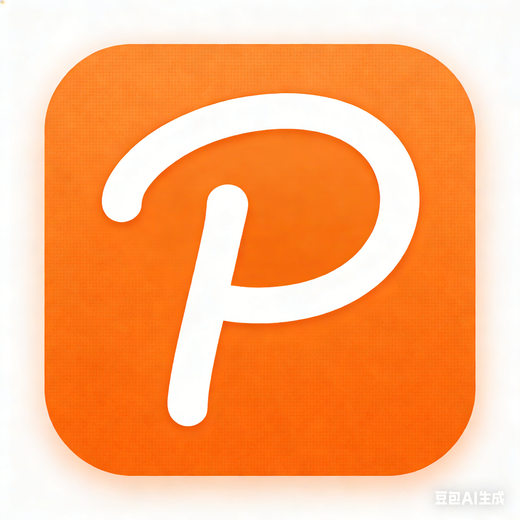

# ClipVault

<p align="center">
  
</p>

<p align="center">
  <b>剪切板+ 图床管理工具</b>
</p>

<p align="center">
  <a href="./LICENSE">
    
  </a>
  
  
</p>

> **注意**: 本项目是基于 [EcoPaste](https://github.com/EcoPasteHub/EcoPaste) 的衍生作品，遵循 Apache-2.0 许可证。感谢 EcoPasteHub 团队的开源贡献！

---

## ✨ 特性

- 🎨 **现代化 UI** - Windows 11 风格设计，简洁美观
- 🏷️ **自定义标签** - 快速创建标签，分类管理剪贴板内容
- 🖼️ **图床管理** - 支持阿里云 OSS、七牛云等，一键上传截图到云端
- 🔒 **加密同步** - AES-256 端到端加密，通过云盘实现跨设备同步
- ⌨️ **快捷键支持** - 快速唤出、导航、粘贴、图床上传
- 🚫 **排除应用** - 支持设置忽略特定应用（如密码管理器）的剪贴板内容
- 🌙 **深色模式** - 自动跟随系统主题
- 🌍 **多语言** - 简体中文、繁体中文、英文、日文

---

## 📸 界面预览

### 主界面
<p align="center">
  
</p>

### 偏好设置 - 图床配置
<p align="center">
  
</p>

### 偏好设置 - 排除应用
<p align="center">
  
</p>

### 偏好设置 - 快捷键
<p align="center">
  
</p>

### 标签管理
<p align="center">
  
</p>

---

## 📥 下载安装

从 [Releases](https://github.com/yourusername/ClipVault/releases) 页面下载最新版本。

### Windows
- `.exe` - 安装程序
- `.msi` - Windows Installer

### macOS
- `.dmg` - Intel 芯片
- `.dmg` - Apple Silicon 芯片

### Linux
- `.AppImage` - 通用格式
- `.deb` - Debian/Ubuntu
- `.rpm` - Fedora/RHEL

---

## 🚀 快速开始

### 默认快捷键

| 功能 | Windows/Linux | macOS |
|------|--------------|-------|
| 打开剪贴板 | `Ctrl + Shift + V` | `Cmd + Shift + V` |
| 打开设置 | `Alt + X` | `Option + X` |
| 上传到图床 | `Ctrl + Shift + P` | `Cmd + Shift + P` |
| 选择条目 | `Tab` / `↑↓` | `Tab` / `↑↓` |
| 切换分组 | `← / →` | `← / →` |

### 标签功能

1. 点击顶部选项卡右侧的 **+** 按钮
2. 输入标签名称，按回车即可创建
3. 点击标签即可筛选相关内容

### 图床设置

1. 打开偏好设置 → 图床设置
2. 启用"启用图床功能"
3. 点击"添加图床"配置您的云存储
4. 支持：阿里云 OSS、七牛云、腾讯云 COS 等
5. 可按 `Ctrl + Shift + P` 快速上传最新截图

### 排除设置

1. 打开偏好设置 → 剪贴板 → 排除设置
2. 添加需要排除的应用名称（如 1Password、KeePass）
3. 从这些应用复制的内容将不会被记录

### 同步设置

1. 打开偏好设置 → 同步
2. 启用"启用同步"
3. 选择同步目录（建议使用云盘同步文件夹）
4. 可选：启用 AES-256 加密

---

## 🛠️ 开发

### 技术栈

- **前端**: React + TypeScript + Ant Design + UnoCSS
- **后端**: Rust + Tauri v2
- **状态管理**: Valtio
- **国际化**: i18next

### 环境要求

- Node.js 18+
- Rust 1.70+
- pnpm

### 本地开发

```bash
# 克隆仓库
git clone https://github.com/yourusername/ClipVault.git
cd ClipVault

# 安装依赖
pnpm install

# 启动开发服务器
pnpm dev

# 构建生产版本
pnpm build
```

---

## 📄 许可证

本项目采用 [Apache-2.0](./LICENSE) 许可证。

本项目包含来自 [EcoPaste](https://github.com/EcoPasteHub/EcoPaste) 的代码，版权归属 EcoPasteHub 及其贡献者。

---

## 💝 赞助支持

> **关于作者**：这款软件是我在**失业期间**完成的。如果你发现 ClipVault 对你有帮助，欢迎请我喝杯咖啡 ☕️，这将是对我最大的鼓励！

<div align="center">

| 微信支付 | 支付宝 |
|:--------:|:------:|
|  |  |

</div>

**你的支持将用于：**
- ☕️ 买杯咖啡保持开发动力
- 🚀 服务器和域名费用
- 💡 持续开发新功能

感谢每一位支持者的鼓励！

---

## 🙏 致谢

- [EcoPaste](https://github.com/EcoPasteHub/EcoPaste) - 基础架构和核心功能
- [Tauri](https://tauri.app/) - 跨平台桌面应用框架
- [React](https://react.dev/) - 前端 UI 框架
- [Ant Design](https://ant.design/) - 组件库

---

## 🗑️ 周期删除说明

ClipVault 支持自动清理历史记录，帮助你管理存储空间：

### 配置方法

1. 打开偏好设置 → 历史记录
2. 设置保留时长（支持天/周/月/年）
3. 设置最大条数限制（可选）

### 清理规则

- ⏰ **时间清理**：超过设置时长的历史记录自动删除
- 📊 **数量清理**：超过最大条数时，自动删除最旧的内容
- 🖼️ **图片清理**：删除历史记录时，同时清理本地存储的图片文件

### 注意事项

- 删除操作不可恢复，请确保已备份重要内容
- 建议开启同步功能，防止数据丢失
- 清理操作在应用启动时自动执行

---

<p align="center">
  Made with ❤️ by ClipVault Team
</p>
